# 🛒 E-Commerce App (Amazon Clone)

## ⚠️ Disclaimer
The backend of this project is hosted on a free server using Render. Before running the application, download and execute the following file in the terminal:

🔗 [Download ConcurrentApiCaller](https://drive.google.com/file/d/1NR6pQlaEMbLLXzMvfd08MzsvZu6w5Q4D/view?usp=share_link)

```sh
java ConcurrentApiCaller
```
Once the response is **OK**, you can proceed with using the app.

---

## ✨ Features

### 🔄 Caching & Single Source of Truth
- 🗄️ The application follows a **Single Source of Truth** principle, ensuring data consistency.
- 📦 **Caching Mechanism**: All data is first stored in a local database before being displayed in the UI.
- 🚀 Improves performance, provides offline support, and reduces redundant API calls.

### 🔐 Authentication
- ✅ **Login Page**: User authentication using **Bearer Token**.
- 📝 **Registration Page**: New users can create an account.
- 🔄 **Forgot Password**: Users receive an **OTP via email** to reset their password.

### 🛍️ Shopping
- 🏠 **Home Screen**: Displays products with an option to **add to cart**.
- 🎯 **Filtering**: Filter products based on various criteria.
- 🛒 **Cart Screen**: View added products and total price.
- 🏷️ **Checkout**: Enter **address, email, and mobile number** before proceeding to payment.
- 💳 **Payment Integration**: Supports **Razorpay UPI & Card payments**.

### 📦 Orders & Profile
- 📋 **Orders Page**: View all past orders.
- 👤 **Profile Page**: Manage addresses and log out.

---

## 📸 Screenshots

### 🔑 Authentication Screens
- **Intro Screen**  
  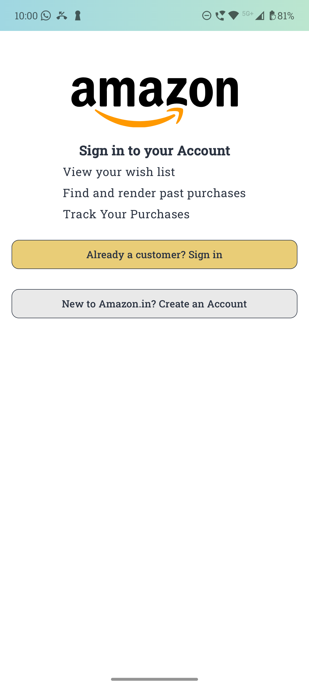
- **Login Screen**  
  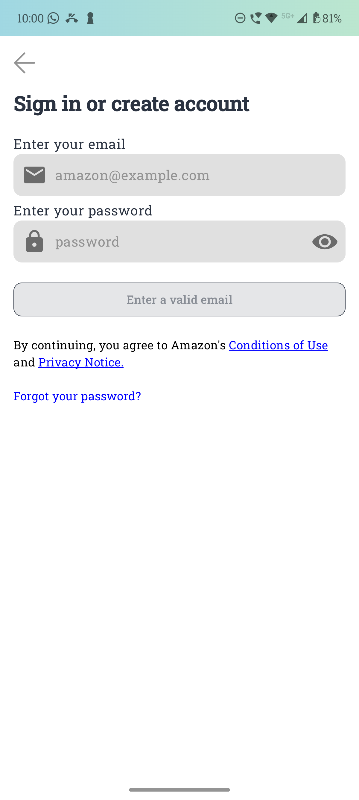 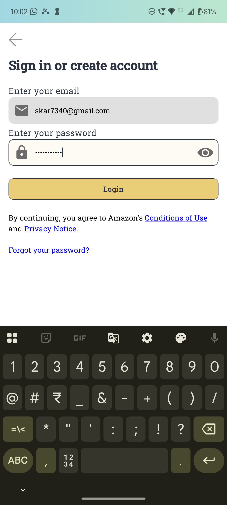
- **Registration Screen**  
  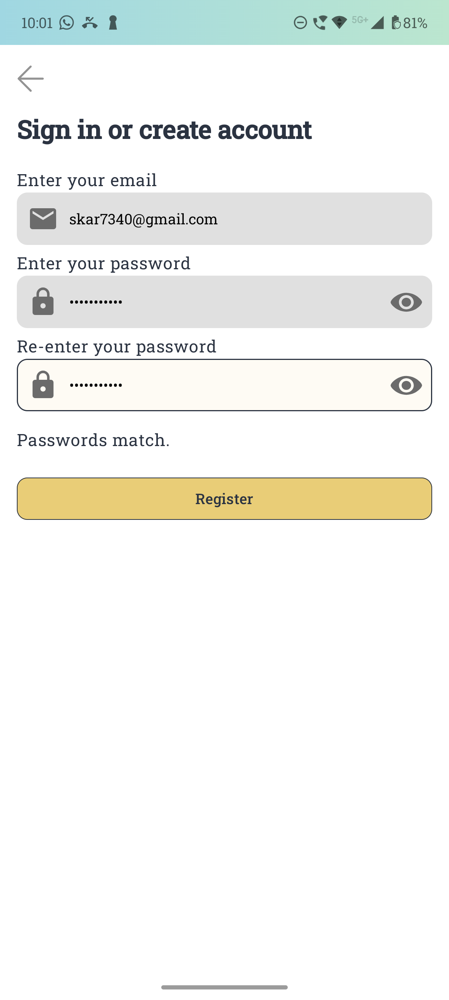 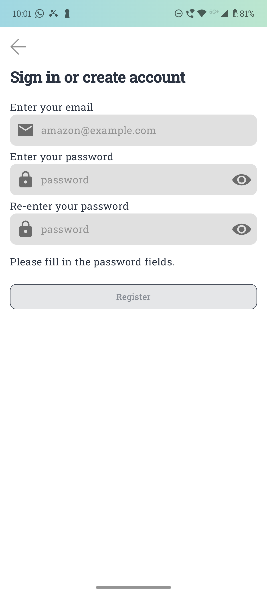
- **Forgot Password - OTP Verification**  
  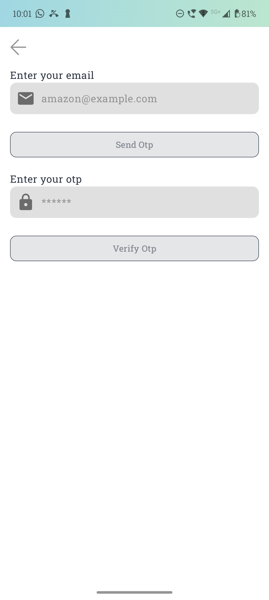 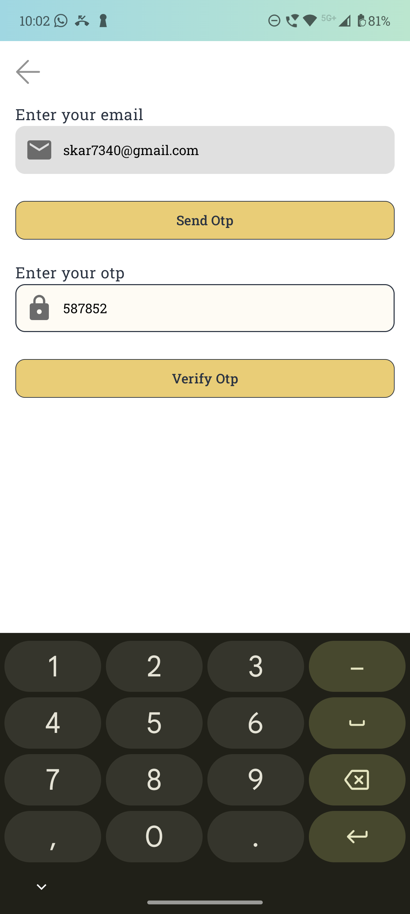  
  📧 **Received OTP Email**  
  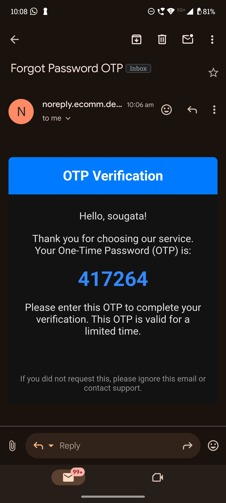
- **Change Password**  
  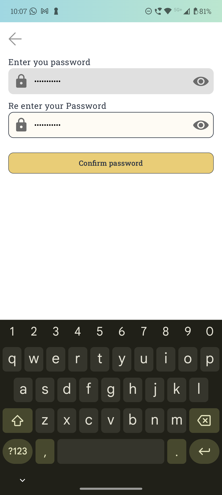

### 🛍️ Shopping Screens
- **Home Screen**  
  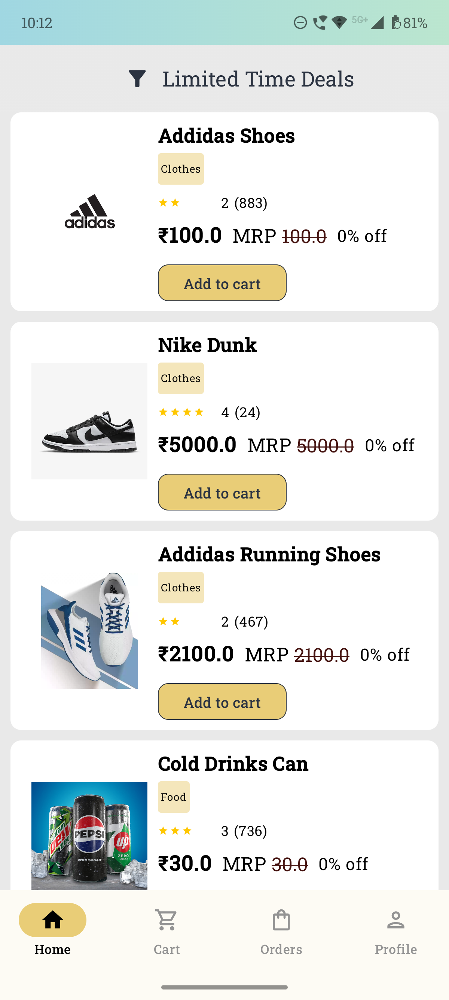
- 🎥 **Home Screen - GIF (Auto Play)**  
  
- **Filter Screens**  
  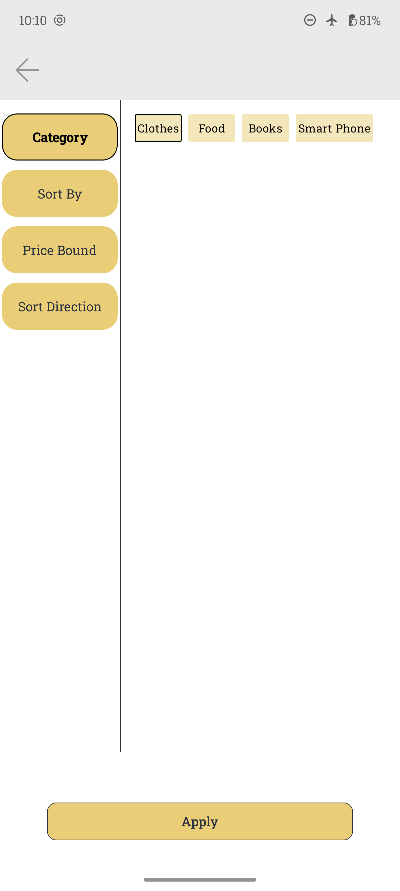 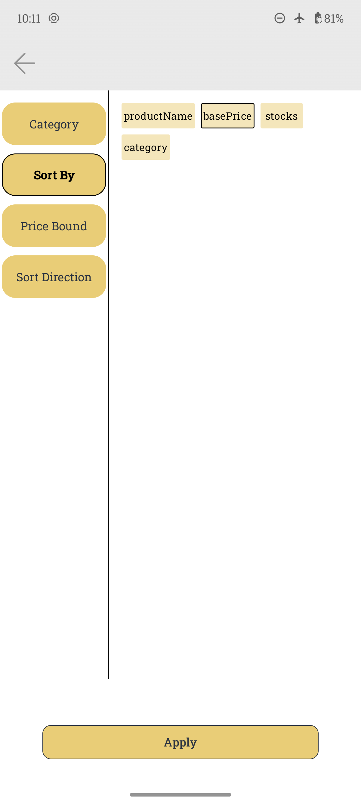  
  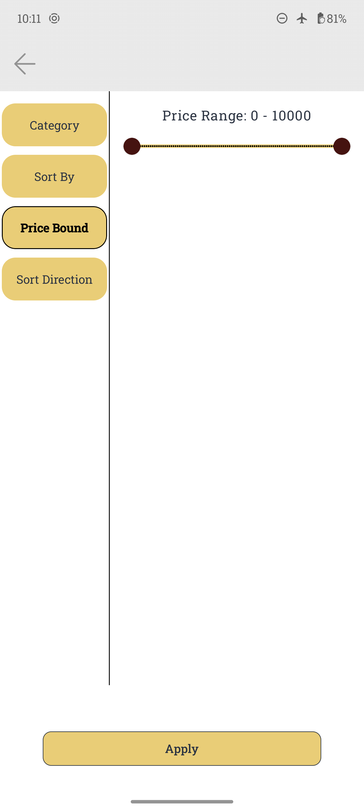 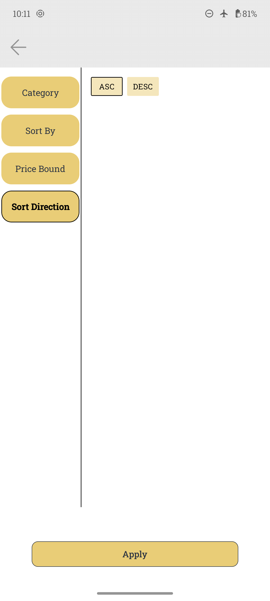

- 🎥 **Filter Screen - GIF (Auto Play)**  
  

### 🛒 Cart & Checkout Screens
- **Cart Screen**  
  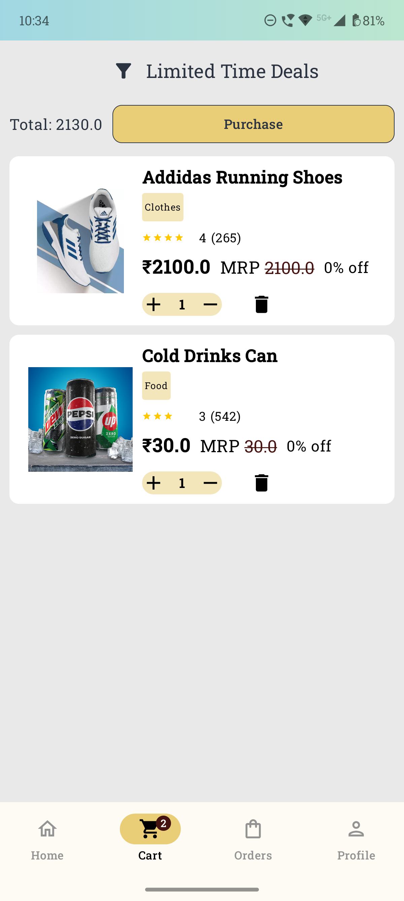
- 🏷️ **Checkout (Bottom Sheet for Address & Contact Details)**  
  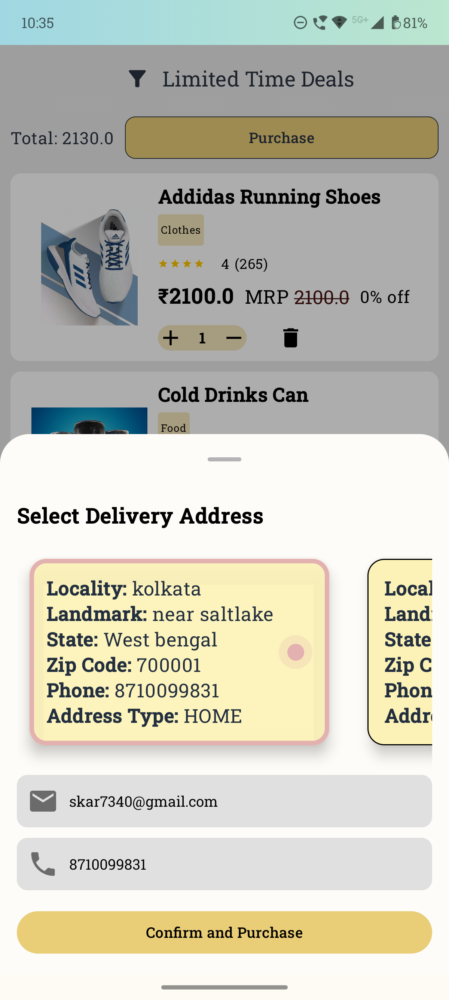
- 💳 **Payment (Razorpay UPI & Card Demo)**  
  🎥 

### 📦 Orders & Profile Screens
- **Orders Page**  
  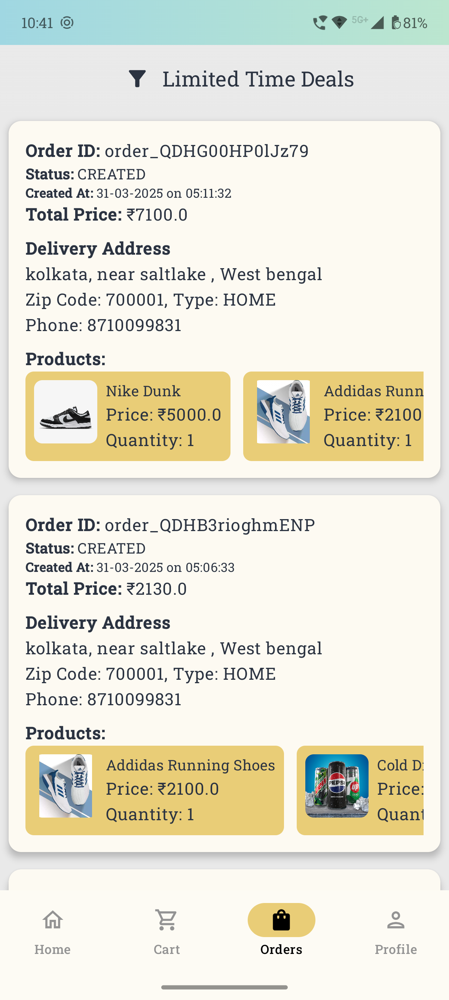
- **Profile Page**  
  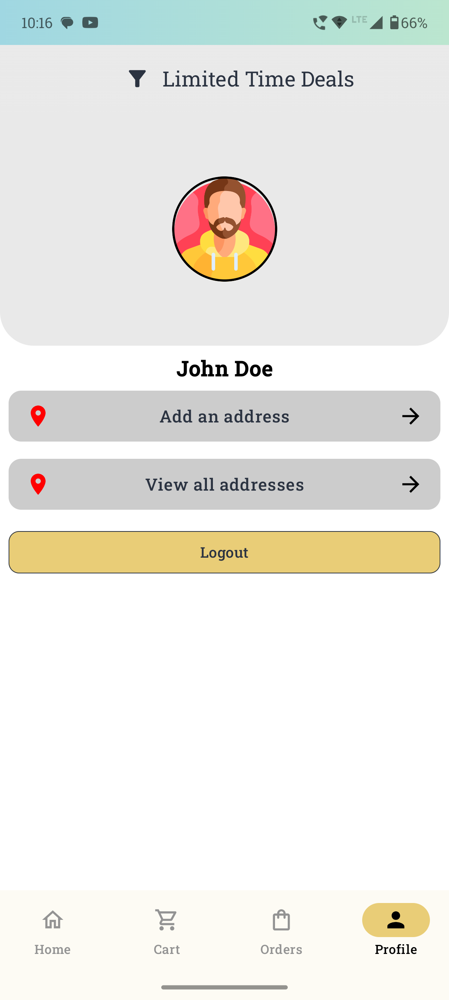
- **Add Address**  
  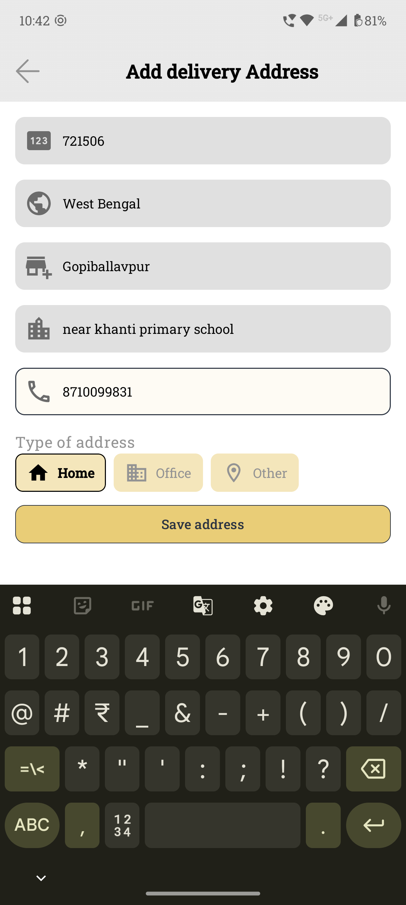
- **View Addresses**  
  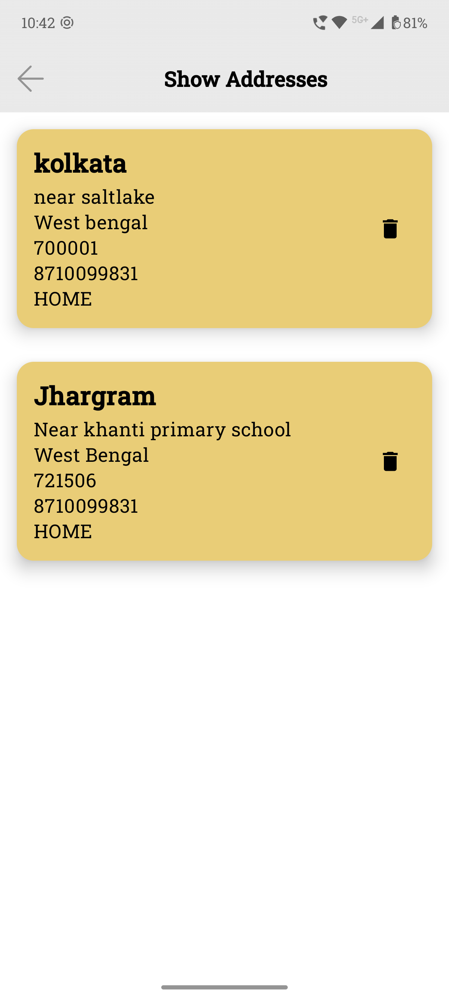
- **Logout (Redirect to Intro Screen)**  
  🎥 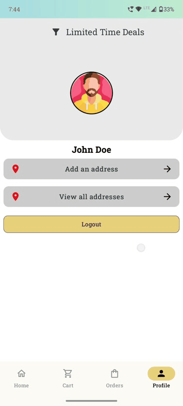

---

## 🛠️ Setup & Installation
1. Clone the repository:
   ```sh
   git clone https://github.com/Sougata1st/Amazon.git
   ```
2. Navigate to the project folder:
   ```sh
   cd your-repo
   ```
3. Run the backend API caller:
   ```sh
   java ConcurrentApiCaller
   ```
4. Build and run the app on **Android Studio** or your preferred IDE.

---

## 📜 License
This project is **open-source** and available under the **MIT License**.
